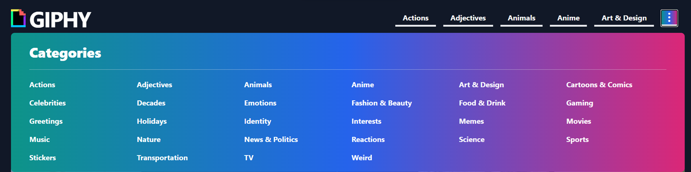
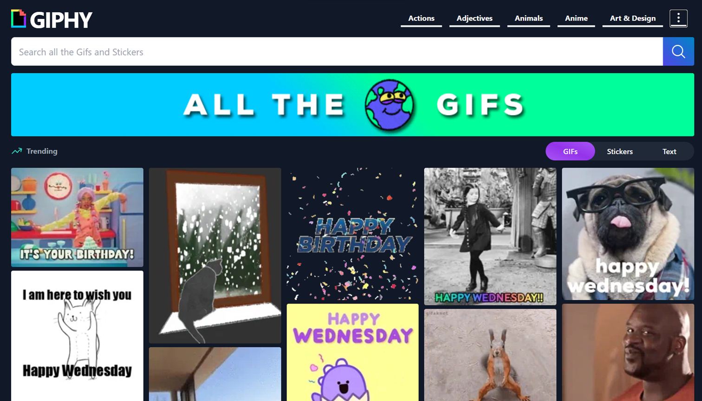
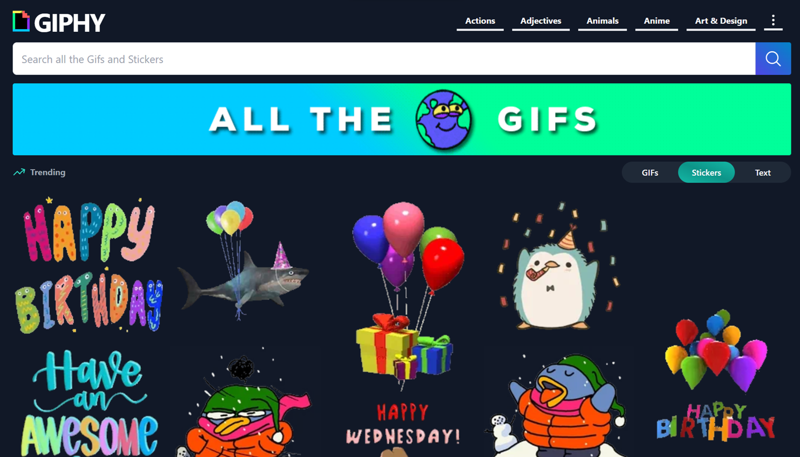
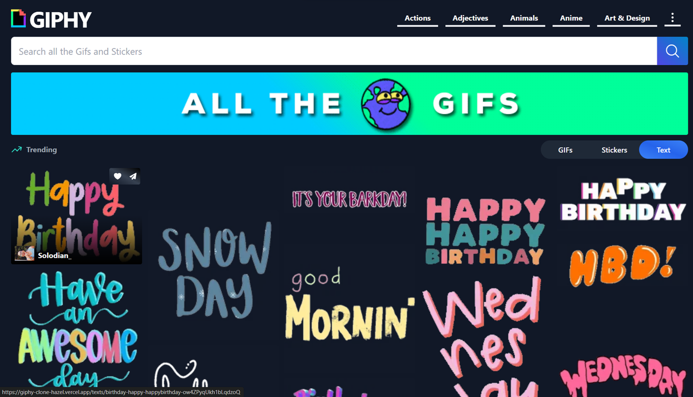
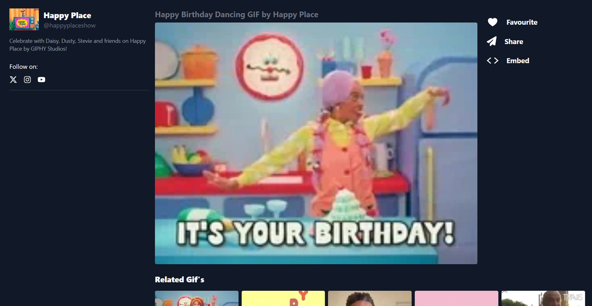
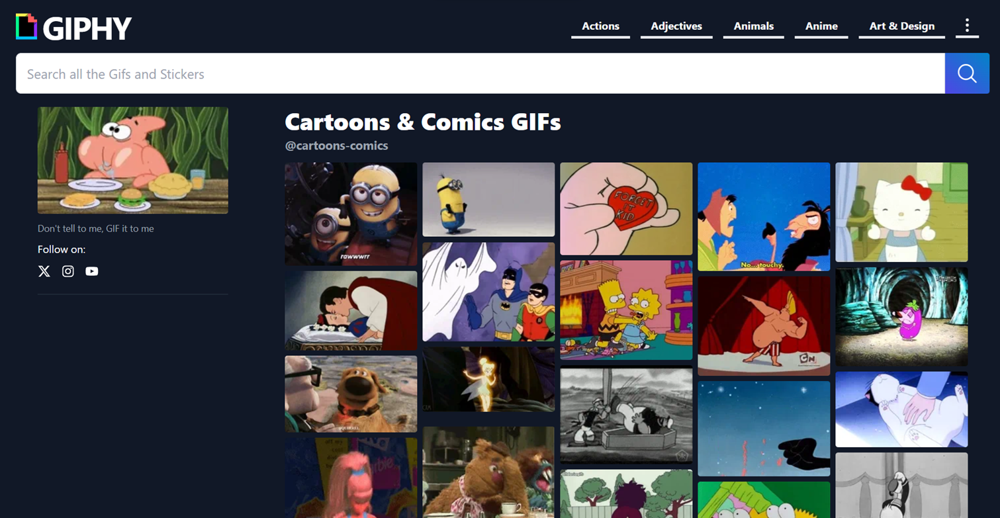
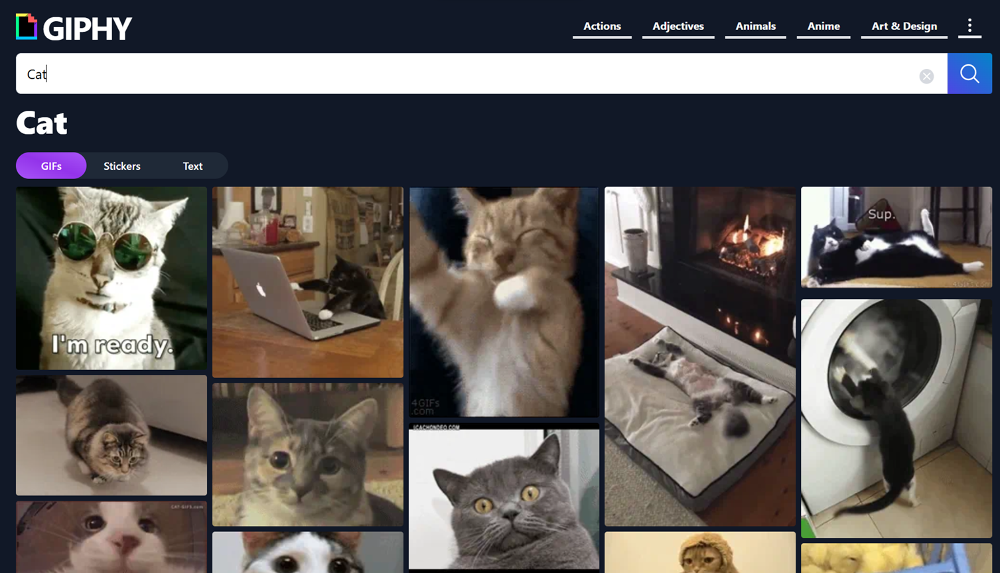

# 🎥 **Giphy Clone**

**[Live Demo](https://giphy-clone-hazel.vercel.app/)**

**Giphy Clone** is a modern, feature-packed web application that reimagines how users explore and interact with GIFs. Built with ReactJS and powered by the **Giphy API**, this platform offers a seamless experience for discovering, organizing, and sharing GIFs, stickers, and text-based content. Whether you’re looking for trending content or building a personalized collection, this app delivers speed, elegance, and functionality.

---

## 🔥 **Key Features**

- **Multi-Content Filtering**: Instantly toggle between **GIFs**, **stickers**, and **text** with a single click.
- **Rich GIF Details Page**: Dive deeper with:
  - **User profiles** (uploader details, social links).
  - **Descriptions & tags** for context.
  - **Related GIF suggestions** to keep the fun going.
  - **Action buttons**:
    - ❤️ **Add to Favorites** (saves to a personalized collection).
    - 🔗 **Copy GIF Link** (one-click sharing).
    - 📋 **Generate Embed Tag** (ready-to-use HTML snippets).
- **Favorites Hub**: Securely store and manage your most-loved GIFs in a dedicated page.
- **Trending Now**: Stay updated with real-time trending GIFs and stickers.
- **Responsive Design**: Flawless experience on mobile, tablet, and desktop.
- **API-Driven**: Live data from Giphy ensures fresh, dynamic content.

---

## 🖼️ **Screenshots**

### Header

  
_The Header section showcase different gifs categories._

### Home

  
_The homepage showcases trending GIFs and a search bar for easy navigation._

### Stickers

  
_Browse and use fun stickers in the app._

### Text

  
_Text Gifs._

### SingleGif

  
_View individual GIFs with details, related suggestions, and action buttons._

### Categories Page

  
_Explore GIFs by category for a more organized experience._

### Search

  
_Search for specific GIFs, stickers, or text templates._

---

## 🎥 **Video Walkthrough**

Watch the full demo on LinkedIn to see the project in action:  
  
_Click the badge above to see features like advanced filtering, favorites management, and more!_

---

## 🛠️ **Built With**

- **Frontend**: ReactJS, Tailwind CSS
- **State Management**: React Context API
- **API Integration**: Giphy Official API
- **Deployment**: Vercel
